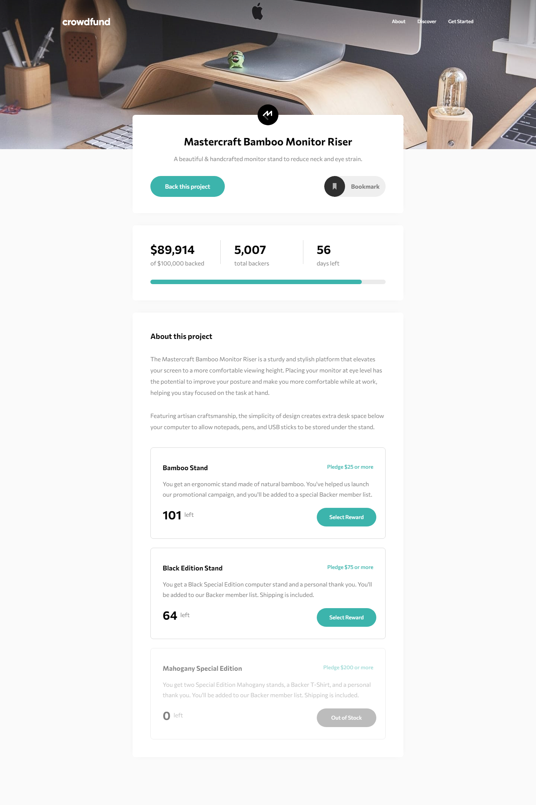

# Frontend Mentor - Crowdfunding product page solution

This is a solution to the [Crowdfunding product page challenge on Frontend Mentor](https://www.frontendmentor.io/challenges/crowdfunding-product-page-7uvcZe7ZR). Frontend Mentor challenges help you improve your coding skills by building realistic projects. 

## Table of contents

- [Overview](#overview)
  - [The challenge](#the-challenge)
  - [Screenshot](#screenshot)
  - [Links](#links)
- [My process](#my-process)
  - [Built with](#built-with)
  - [What I learned](#what-i-learned)
  - [Continued development](#continued-development)
- [Author](#author)

## Overview

### The challenge

Users should be able to:

- View the optimal layout depending on their device's screen size
- See hover states for interactive elements
- Make a selection of which pledge to make
- See an updated progress bar and total money raised based on their pledge total after confirming a pledge
- See the number of total backers increment by one after confirming a pledge
- Toggle whether or not the product is bookmarked

### Screenshot



### Links

- HTML Solution URL [HTML](https://github.com/JustANipple/crowdfunding-product-page/blob/master/index.html)
- SCSS Solution URL [SCSS](https://github.com/JustANipple/crowdfunding-product-page/blob/master/styles/scss/main.scss)
- JS Solution URL [JS](https://github.com/JustANipple/crowdfunding-product-page/tree/master/scripts)
- Live Site URL: [LIVE](https://justanipple.github.io/crowdfunding-product-page/)

## My process

### Built with

- Semantic HTML5 markup
- CSS custom properties
- Flexbox
- CSS Grid
- Mobile-first workflow
- Josh Comeau CSS custom reset
- JavaScript components
- JavaScript Animations

### What I learned

rewards are components that repeat and just change some values that can be easily stored into an array of objects and used into a universal component. I managed making something that can be reused. If anyone wanted to add a reward, it would be just necessary to fill some details in the array of objects to see it in the list

This is the universal reward component:
```js
      component.innerHTML = 
      `
      <div class="reward">
        <div class="reward_header">
          <input type="radio" class="header_radio" name="radioBtn">
          <div class="header_block">
            <p class="reward_type">${rewardInfos[i].type}</p>
            <p class="reward_price">Pledge $<span class="price_value">${rewardInfos[i].price}</span> or more </p>
          </div>
        </div>
        <p class="reward_description">${rewardInfos[i].description}</p>
        <p class="reward_left"> 
          <span class="left_amount" id="${rewardInfos[i].id}">${rewardInfos[i].left}</span> left
        </p>
        <button class="reward_btn" id="${rewardInfos[i].id}">Select Reward</button>
      </div>
  
      <div class="pledge">
        <p class="pledge_title">Enter your pledge</p>
        <div class="pledge_insertion">
          <label for="price" class="insertion_label">$</label>
          <input type="number" id="price" class="insertion_input">
          <button class="insertion_btn" id="${rewardInfos[i].id}">Continue</button>
        </div>
      </div>
      `;
```

### Continued development

Writing all styles and animations made me feel like i need a framework to stop writing everything by hand. Starting with bootstrap would make creating and styling elements easier. I don't want to get straight to react or vue because i still need to practice vanilla JavaScript, but i'll get there

## Author

- Frontend Mentor - [@JustANipple](https://www.frontendmentor.io/profile/JustANipple)